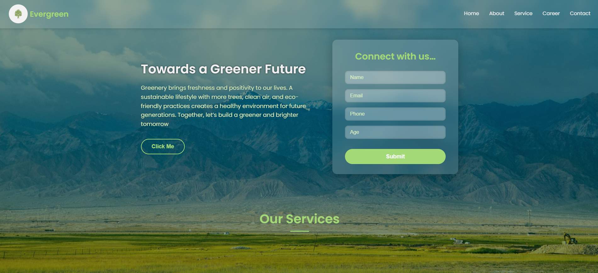

# Eco-Friendly Landing Page

## Overview

This is a modern, responsive landing page designed with an eco-friendly and nature-inspired theme. It features a full-page background image of greenery, a glassmorphism-style navbar, a hero section with a heading and contact form, and a services section.

The design uses soft green and white colors, smooth hover animations, and is fully responsive for desktop and mobile devices.

---

## Live Demo  
[Click here to view]()

### Homepage  
  

## Features

- **Full-page nature background** with a dark overlay for readability.
- **Glassmorphism navbar** with transparent background and blur effect.
- Navigation menu with smooth green underline animation on hover.
- **Hero section** split into two parts:
  - Left side: Heading, paragraph about sustainability, and a "Click Me" button with hover glow.
  - Right side: Contact form with frosted glass effect, including fields for Name, Email, Phone, Age, and a submit button.
- **Services section** with a bold heading and thin green underline.
- Responsive layout that adapts to different screen sizes.
- Uses modern fonts (Poppins) and simple pixel-based sizing for easy understanding.

---

## How to Use

1. **Download or clone the repository** to your local machine.

2. **Open the `index.html` file** in any modern web browser (Chrome, Firefox, Edge, Safari).

---

## Customization

- Replace the background image URL in the CSS (`body` selector) with your own nature-themed image if desired.
- Modify text content in the HTML to suit your project needs.
- Add more sections or style adjustments as you learn and grow your skills.

---

## Credits

- Background image from [Unsplash](https://unsplash.com/photos/6anudmpILw4) (free to use).
- Font from [Google Fonts - Poppins](https://fonts.google.com/specimen/Poppins).

---

## License

This project is open source and free to use for learning and personal projects.

---

